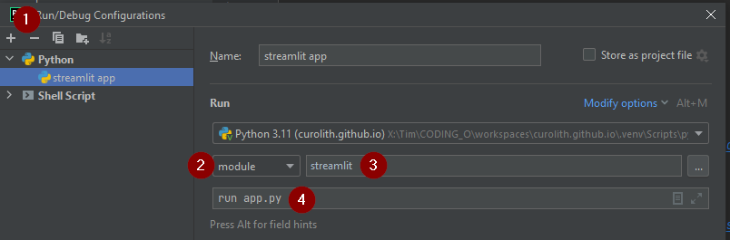

# readme

## Setting up the streamlit environment

### Windows

Open the terminal in the root directory:
- `python -m venv .venv`
- `.venv\Scripts\activate.bat`
- (in venv) `pip install streamlit`
- (optional) to test the setup : (venv) `streamlit hello`

If this doesn't work check out the [streamlit docs](https://docs.streamlit.io/get-started/installation/command-line)

### Other operating systems

The [streamlit docs](https://docs.streamlit.io/get-started/installation/command-line) contain tutorials for setup on 
other operating systems.

## Setting up with pycharm IDE

- Configure the python interpreter to your venv:
In `Project settings > Project interpreter` click `add interpreter > local interpreter`
then navigate to your root and `.venv/Scripts/python.exe`

- (optional) Add the app as runconfig:
  - Use the plus (1) symbol to add the configuration, choose python
  - Switch from script to module (2)
  - enter `streamlit` as module (3)
  - enter `run app.py` as parameters (4)
  
  

## For details on the streamlit app, check ou the [dedicated page](stuff_app/streamlit_app.md).